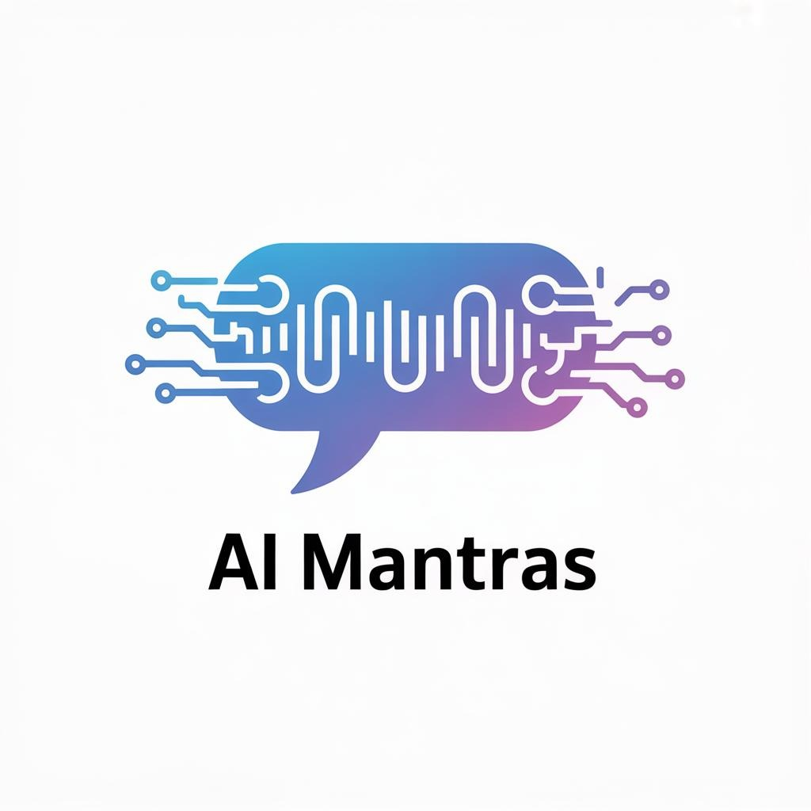

<p align="center">
  
</p>

<h1 align="center">AI Mantras</h1>
<p align="center"><strong>An AI prompt framework to help everyone think deeper and collaboratively.</strong></p>
<p align="center"><em>This framework makes it easier for the average person to engage in complex conversation or analysis with AI by doing some of the heavy lifting.</em></p>

<p align="center">
  <a href="https://github.com/kd5ziy/AIMantras/stargazers"></a>
  <a href="https://github.com/kd5ziy/AIMantras/network/members"></a>
  <a href="https://github.com/kd5ziy/AIMantras/blob/master/LICENSE"></a>
  <a href="https://github.com/kd5ziy/AIMantras/graphs/contributors"></a>
  <a href="https://www.linkedin.com/in/james-b-7957ba58/"></a>
</p>

<p align="center">
  ☕ If you use AI Mantras and like how it helped you out, feel free to <a href="https://buymeacoffee.com/kd5ziy">buy me a coffee</a><br>
  <em>(software developers run on coffee)</em>
</p>

---

## Quick Start

Choose your integration method:

| Method | Best For | Setup Time |
|--------|----------|------------|
| **[MCP Server](#mcp-server)** | Claude Code users wanting full integration | 5 minutes |
| **[Claude Command](#claude-command)** | Claude Code users wanting simple `/Mantras` command | 2 minutes |
| **[Manual Loading](#any-ai-model)** | Any AI model (ChatGPT, Gemini, local LLMs, etc.) | Immediate |

**See [HowToUse.md](HowToUse.md) for detailed setup instructions.**

### Quickest Start (Any AI)
1. Download or clone this repository
2. Give your AI model access to the files
3. Ask it to read `AIMantra.md` and follow its instructions
4. Make your request - the framework handles the rest

## The Four Pillars

AI Mantras is built on four complementary pillars:

| Pillar | Question | Purpose |
|--------|----------|---------|
| **Personas** | WHO | Specialized identities with expertise, style, and constraints |
| **Patterns** | HOW | Reusable reasoning structures and thinking templates |
| **Principles** | WHY | Guiding values that shape behavior (internalized, not announced) |
| **Skills** | WHAT | Actionable capabilities personas can invoke |

Together, these enable consistent, high-quality AI collaboration across complex multi-step tasks.

## Repository Layout
```
Prompt-AI-Mantras/
├── personas/              # WHO - 11 specialized personas
│   ├── orchestration/     # Plan & coordinate (Bernstein, Hopper, Lovell)
│   ├── domain/            # Execute work (Clara, Kestra, Watson, Goeth, Franklin)
│   └── evaluation/        # Review & approve (Ada, Drucker, Rickover)
├── patterns/              # HOW - 9 reasoning patterns
│   ├── Layer 1            # Foundational (planning, orchestration, self-eval, meta-rules)
│   ├── Layer 2            # Thinking (chain-of-thought, rule-based, guardrail-creative)
│   └── Layer 3            # Evaluation (criterion-based, threat-modeling)
├── principles/            # WHY - Guiding values (wisdom, justice, courage, temperance)
├── skills/                # WHAT - 24 actionable capabilities
│   ├── research/          # Information gathering
│   ├── analysis/          # Analytical capabilities
│   ├── creation/          # Content generation
│   ├── evaluation/        # Assessment capabilities
│   ├── orchestration/     # Workflow coordination
│   └── utility/           # Framework navigation (help)
└── projects/              # Applied recipes (per domain/project)
```

## How to Use Personas
1. Read `development/personas-and-patterns-context.md` + `development/project-plan.md` for shared context.
2. Pick a persona whose name-purpose file matches your need (e.g., `Clara-Financial-Analyst`).
3. Follow its sections: Purpose, Domain Expertise, Style, Rules, Recommended Patterns, Example Invocations, Output Expectations, Failure Modes.
4. Cite the persona explicitly in prompts (`Persona: Hopper …`).

## How to Use Patterns
1. Load relevant pattern files under `patterns/` (e.g., `planning-phase`, `orchestration`, `recursive-self-eval`, `meta-rules`).
2. Embed the pattern template verbatim when composing prompts so agents follow the structure.
3. Combine multiple patterns as instructed in each persona’s “Recommended Patterns” section.

## Default Workflow (Planner → Worker → QA)
1. **Planner (Hopper + Planning Phase Pattern)**
   - Restate mission, inputs, constraints, risks, acceptance criteria.
   - Select personas/patterns for each phase and emit ready-to-run orchestration prompt.
2. **Worker(s) (Clara, Kestra, Goeth, Franklin, etc.)**
   - Execute domain-specific work using assigned patterns (chain-of-thought, rule-based, guardrail, meta-rules).
   - Call out assumptions, data gaps, and blockers for QA.
3. **QA (Ada + Recursive Self-Eval + Meta-Rules)**
   - Audit outputs against plan, rules, and guardrails.
   - Produce issues list, recommendations, and refined/approved version.

## Meta-Rules & Style
- Declare meta preferences via `patterns/meta-rules.md` to control tone, caution, evidence, and prohibited behaviors.
- Apply them in both worker and QA stages for consistent voice.

## Extending the Wiki
- Add new personas or patterns by duplicating existing templates and keeping files atomic.
- Default to additive edits; avoid destructive rewrites unless coordinated.

## How It Works

The framework automatically triages your request to the right complexity tier:

| Tier | Description | What Happens |
|------|-------------|--------------|
| **Simple** | Single question, factual, bounded | One persona answers directly |
| **Moderate** | Analysis, structured reasoning | Persona + patterns + self-review |
| **Complex** | Multi-domain, high stakes, ambiguous | Full orchestration workflow |

**Entry Point**: `AIMantra.md` handles this triage automatically.

## Key Concepts

### Separation of Powers
- **Orchestrators** plan but don't execute or evaluate
- **Domain personas** execute but don't self-evaluate
- **Evaluators** assess but don't generate content
- **Humans** retain final authority

### Two-Phase Workflow
1. **Plan → Evaluate → Approve** (before work begins)
2. **Execute → QA → Evaluate** (before delivery)

## Features

### Multi-Agent Mode (New!)
AI Mantras now supports **true multi-agent execution** where each persona runs as an isolated agent:
- **Context Isolation**: Agents only see their persona, task, and inputs - no shared history
- **Multi-Provider**: Use Anthropic (Claude) or OpenAI (GPT) models per persona
- **Parallel Execution**: Run multiple agents simultaneously
- **Separation of Powers**: Enforced at the architecture level, not just prompting

Enable with `MANTRAS_MULTI_AGENT_ENABLED=true`. See [HowToUse.md](HowToUse.md) for setup details.

## Next Steps
- Dedicated orchestration service with queue-based communication
- Project-specific playbooks under `projects/`
- Framework integrations (LangGraph, CrewAI)

## Contributing

Contributions are welcome! See **[CONTRIBUTING.md](CONTRIBUTING.md)** for the complete guide.

### Quick Start

1. Read the [developer documentation](developer-docs/README.md)
2. Create a branch: `git checkout -b feature/your-feature-name`
3. Follow the appropriate guide:
   - [Creating Personas](developer-docs/creating-personas.md)
   - [Creating Patterns](developer-docs/creating-patterns.md)
   - [Creating Skills](developer-docs/creating-skills.md)
   - [Extending MCP Server](developer-docs/extending-mcp-server.md)
4. Test your changes using the [Testing Guide](developer-docs/testing-guide.md)
5. Push and create a Pull Request

### What We're Looking For
- **New personas** - Domain experts, orchestrators, or evaluators
- **New patterns** - Reasoning structures that complement existing ones
- **New skills** - Capabilities that personas can invoke
- **MCP improvements** - Tools and resources
- **Documentation** - Clarity and completeness improvements

## Support This Project

AI Mantras is free and open source under the [Mozilla Public License 2.0](LICENSE).

If this project helps you, consider:
- Giving it a star on GitHub
- [Sponsoring on GitHub](https://github.com/sponsors/kd5ziy)
- [Buying me a coffee](https://buymeacoffee.com/kd5ziy)
- Sharing it with others who might benefit

**Need help implementing AI Mantras for your team?** I'm available for consulting and custom development. [Contact me](mailto:kd5ziy@gmail.com).

## Collaboration & Attribution

Collaboration on this project is warmly welcomed. I believe in the power of community contributions while maintaining clear attribution for individual work.

When using, referencing, or contributing to this project, please respect:
- **Individual attribution** for contributions - we value and preserve the recognition of each contributor's work
- **The MPL 2.0 license terms** - ensuring the collaborative nature of improvements benefits everyone

### About the MPL 2.0 License

The Mozilla Public License 2.0 is a balanced open-source license that:
- **Allows free use and modification** - you can use this project in your own work, commercial or otherwise
- **Requires sharing improvements** - if you modify MPL-licensed files, you must share those modifications under MPL 2.0
- **Permits proprietary combinations** - you can combine this code with proprietary code in larger projects
- **Preserves attribution** - copyright notices and attributions must be maintained

This license strikes a balance between encouraging open collaboration and respecting the intellectual contributions of individual developers. Files you modify must remain open source, but you can use them alongside your own proprietary code.

For complete details, see the [LICENSE](LICENSE) file or visit [mozilla.org/MPL/2.0](https://mozilla.org/MPL/2.0/).

## License

Mozilla Public License 2.0 - see [LICENSE](LICENSE) for details.
